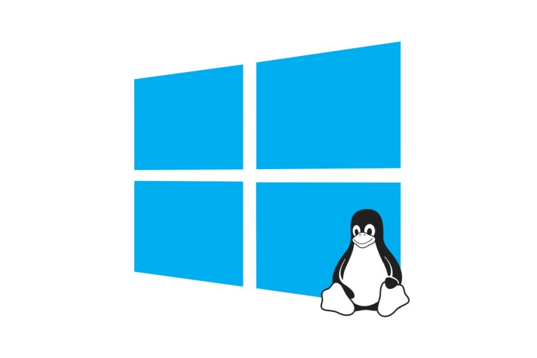
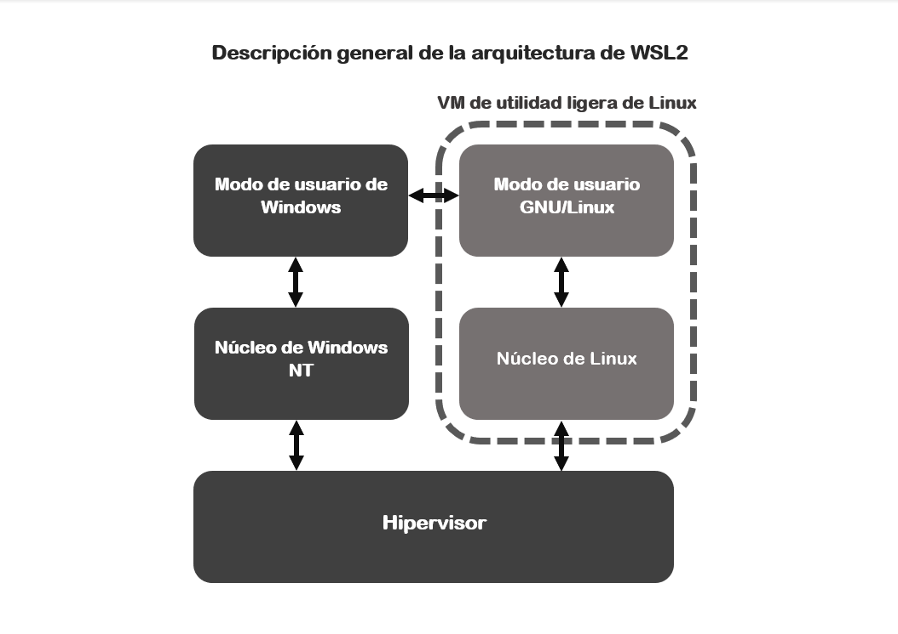

# <b>¿Qué es WSL 2?</b>

Windows Subsystem for Linux 2, mejor conocido como WSL 2, es una versión más reciente y fácil de usar de WSL, la cual es una capa de compatibilidad que fue desarrollada por Microsoft, con el fin de permitir el acceso a las distintas herramientas y aplicaciones de Linux, directamente desde un entorno de Windows.

# <b>Requisitos de WSL 2</b>

Los requisitos del sistema para la utilización de WSL 2 dependen del procesador que el ordenador tenga instalado:

* Para sistemas <b>x64</b> se requiere como mínimo la versión <b>1903</b> con build <b>18362</b> o superior.

* Para sistemas <b>ARM64</b> se requiere como mínimo la versión <b>2004</b> con build <b>19041</b> o superior.

# <b>Arquitectura de WSL 2</b>

Esta versión está disponible desde junio del 2019, donde esta introdujo cambios radicales en su arquitectura, optando a su vez por la virtualización a través de un subconjunto de características de <b>Hyper-V</b>, junto con un <b>núcleo Linux real</b> altamente optimizado (basado en la rama principal 4.19), habilitando así un acceso completo a la API de Linux, permitiendo la ejecución de servicios como <b>Docker</b>.

La instalación de la distribución reside en su propia imagen de disco virtual con formato <b>ext4</b>, y el acceso al sistema de archivos anfitrión se lleva a cabo de manera transparente a través del <b>protocolo 9P</b>. Se promete un incremento sustancial en el rendimiento de lectura y escritura.

