# INSTALACIÓN DE WSL 2

Lo primero que haremos antes de instalar el wsl 2, es verificar si nuestro ordenador cumple con los requisitos requeridos por el software, el cual es compatible **para sistemas x64 desde la versión 1903 en adelante, con build 18362 o superior** y **para sistemas ARM64 desde la versión 2004 en adelante, con build 19041 o superior**.


Dicho esto, para verificar la versión de nuestro sistema operativo. Primero tendremos que presionar la combinación de teclas **Windows + R** para abrir el **comando ejecutar**.


Luego escribiremos **winver** y daremos un clic izquierdo en el botón de **Aceptar** para abrir la ventana de **Acerca de Windows**.

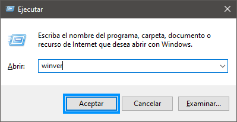

Una vez abierta esta ventana, podremos observar la versión que tiene nuestro sistema operativo, la cual en nuestro es la **Versión 21H1 (Compilación SO 19043. 1766)**, y una vez que hemos verificado la versión de nuestro sistema operativo, procederemos a dar un clic izquierdo en el botón de **Aceptar**.

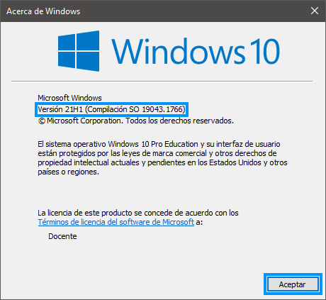

Una vez que hemos comprobado que nuestro sistema cumple con los requisitos de wsl 2, procederemos a activar las opciones de **Hiper-V**, **Plataforma de máquina virtual** y **Subsistema de Windows para Linux**.

Donde para esto tendremos que darle un clic izquierdo al icono de **Buscar** que está ubicada en la barra de tareas.

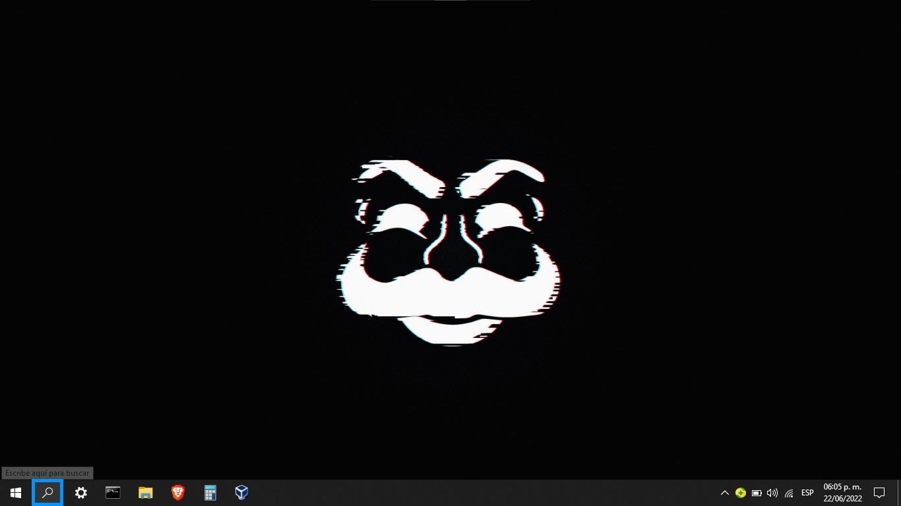

Una vez que le hemos dado clic, escribiremos **Panel de control** y le daremos un clic izquierdo a la que dice **Panel de control Aplicación**.


Luego de haberle dado clic a la aplicación de panel de control, se nos abrirá una ventana que nos muestra todos los elementos del panel de control, en cual procederemos a buscar la opción que dice **Programas y características** y le daremos un clic izquierdo.


Una vez que le hemos dado clic, se nos abrirá una ventana donde podremos **Descargar o cambiar un programa**, y aquí tendremos que buscar una opción que dice **Activar o desactivar las características de Windows** y una vez que la hemos encontrado, le daremos un clic izquierdo.

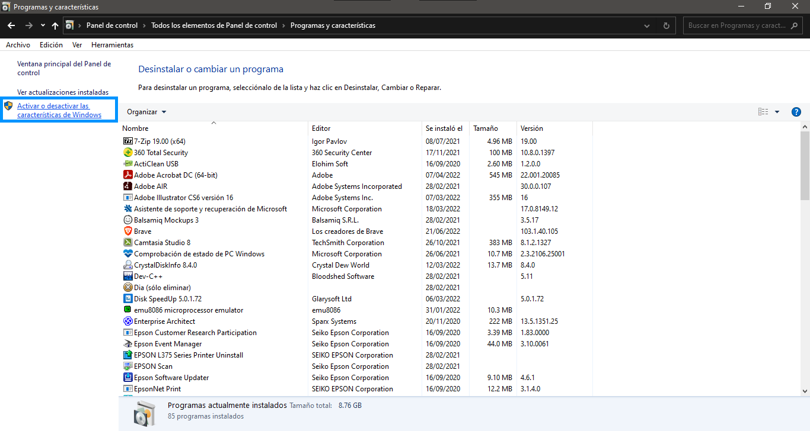

Después de haberle dado clic, se nos desplegara una ventana para **Activar o desactivar las características de Windows** y aquí procederemos a darle un clic izquierdo al botón de **Maximizar tamaño**.


Luego de haber maximizado el tamaño de la ventana, procederemos a ubicar las opciones de **Hiper-V**, **Plataforma de máquina virtual** y **Subsistema de Windows para Linux**.

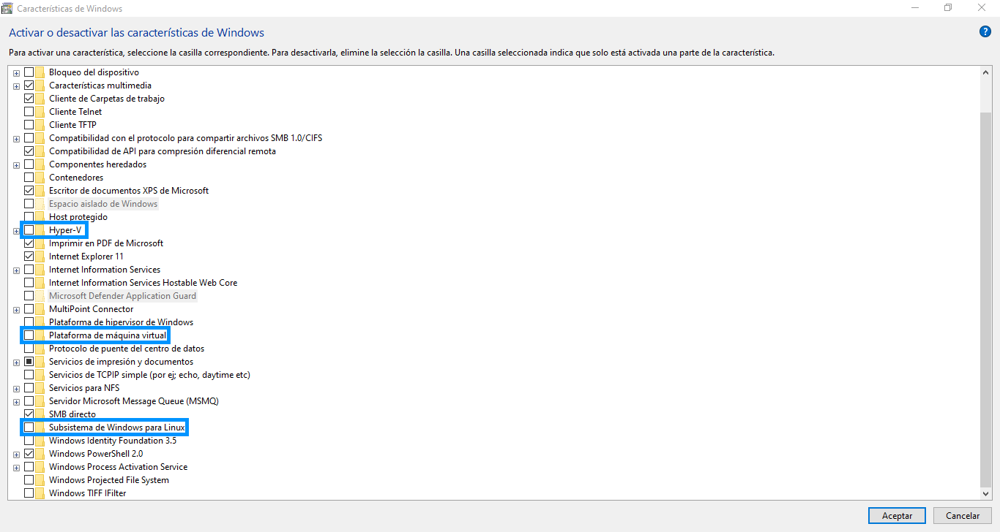

Una vez que los hemos localizado, las activaremos dándoles un clic izquierdo en sus respectivas **casillas de verificación** y seguido de esto, le daremos un clic izquierdo en el botón de **Aceptar**.

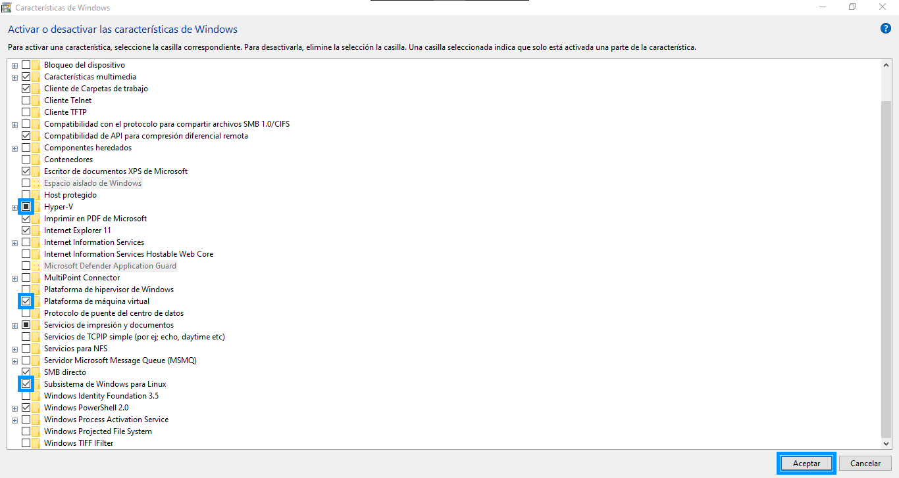

Después de haberle dado clic al botón de aceptar, se dará inicio a la búsqueda de los archivos necesarios para la activación.

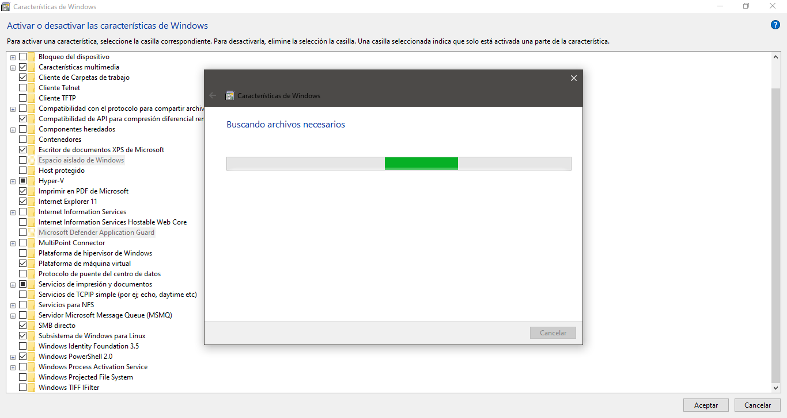

Luego de unos minutos, comenzará a aplicar los respectivos cambios.


Y por último, nos saldrá un mensaje que dice que se han completado los cambios solicitados y nos pedirá reiniciar el ordenador, por lo cual procederemos a dar un clic izquierdo en el botón de **Reiniciar ahora**.

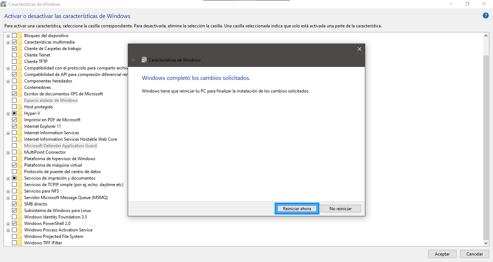

Una vez hecho esto, lo siguiente que haremos será instalar **Windows terminal**, el cual es un programa que nos será de gran utilidad a la hora de usar el wsl 2 y esto lo haremos desde la **Tienda de Microsoft**.

Dicho lo anterior, procederemos abrir la barra de búsqueda y escribiremos **Microsoft Store**, para acto seguido, darle un clic izquierdo a la que dice **Microsoft Store Aplicación**.


Después en la barra de búsqueda de Microsoft Store, escribiremos **Windows terminal**, y le daremos un clic izquierdo a la que dice **Windows Terminal Aplicación**.


Luego de esto, procederemos a darle un clic izquierdo en el botón de **Obtener** para así dar inició a la instalación.

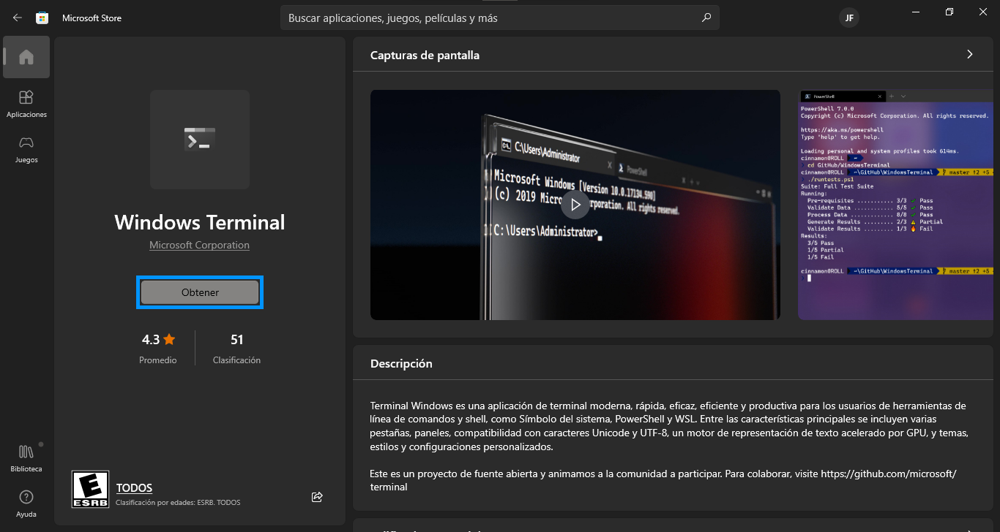

Una vez que se ha terminado de instalar, procederemos a dar un clic izquierdo en el botón de **Abrir**.

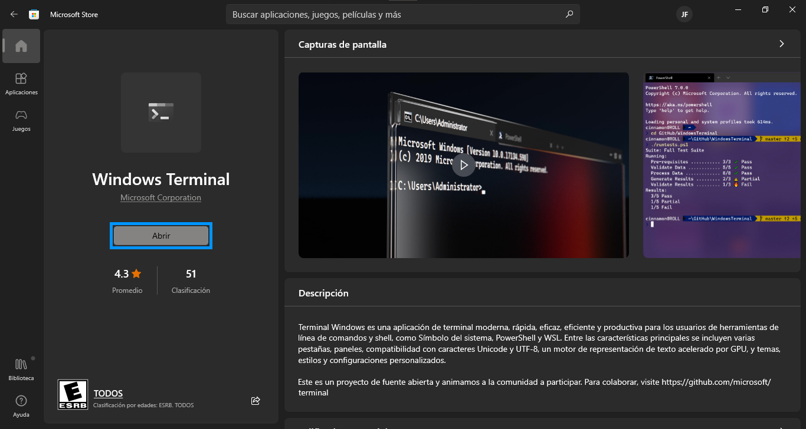

Y listo, como pueden ver ya tendríamos instalado el Windows Terminal.


Ahora, una vez que hemos instalado el Windows Terminal, lo siguiente que haremos será descargar el paquete de actualización del kernel de Linux.

Y esto lo haremos copiando el siguiente link en nuestro navegador, para que así nos dirija a la página en la que podremos hacer la descarga del paquete.

```
https://docs.microsoft.com/es-mx/windows/wsl/install-manual#step-4---download-the-linux-kernel-update-package
```

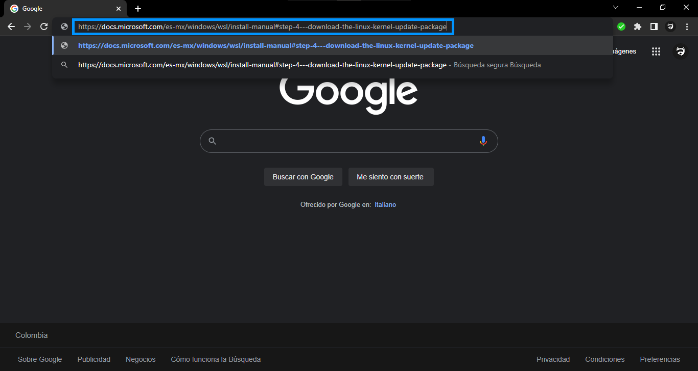

Una vez que estemos en la página, nos ubicaremos en el apartado que dice **Paso 4: Descarga del paquete de actualización del kernel de Linux** y después le daremos un clic izquierdo donde dice **Paquete de actualización del kernel de Linux en WSL 2 para maquinas x64**


Luego de que le hemos dado clic, nos saldrá una ventana en la que podremos seleccionar la carpeta donde queremos guarde la descarga.

En nuestro caso será la carpeta de **Descargas** que ya viene seleccionada por defecto y luego le  darle un clic izquierdo al  botón de **Guardar**


Hecho lo anterior, se dará inicio el proceso de descarga y una vez que este se termine, procederemos a dar un clic izquierdo en el programa descargado.


Una vez que le hemos dado clic, se nos abrirá una ventana de instalación, en la que tendremos que darle un clic izquierdo en al botón de **Next** para así dar inicio a la instalación del programa.


Luego de haberle dado clic al botón next, nos saldrá una barra de carga en la que podremos ver el estado de la instalación.

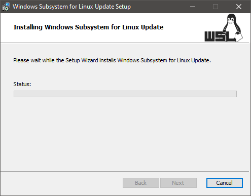

Y una vez que esta haya completado, procederemos a dar un clic izquierdo al botón de **Finish**.


Y listo, ya estaría instalado el paquete de actualización del kernel de Linux.
 
Para verificar que se ha instalado correctamente procederemos a abrir la barra de búsqueda y escribiremos **wsl** y nos debería aparecer una que dice **wsl Ejecutar comando**.


Una vez que lo hemos verificado, procederemos a instalar ahora sí, una distribución de Linux de nuestra preferencia ejecutarla con wsl 2.

En nuestro caso, la distribución que descargaremos será **Kali Linux** y esta, al igual que hicimos con el **Windows Terminal**, la descargaremos desde la **Microsoft Store**.

Así que procederemos a abrir la **Microsoft Store** y en su barra de búsqueda escribiremos **kali linux** y le daremos un clic izquierdo a la que dice **Kali Linux Aplicación**.


Luego de esto, procederemos a darle un clic izquierdo al botón de **Obtener** para que se inicie la instalación.


Y después de que se termine de instalar, le daremos un clic izquierdo en el botón de **Abrir**.


Una vez que se ha abierto, tendremos que esperar unos minutos a para que termine de hacer los últimos retoques de la instalación.


Después de unos cuantos minutos, nos pedirá crear un nuevo usuario, lo creamos y luego presionaremos la tecla **Enter** para continuar.

> **NOTA:** El nombre de usuario debe estar todo minúscula o de lo contrario dará un error, este también puede llevar números.


Una vez que hemos presionado la tecla enter, nos pedirá crear una contraseña, la creamos y luego presionaremos la tecla **Enter** para continuar.

> **NOTA:** En Kali Linux no se ve los asteriscos al momento de escribir la contraseña, esto suele generar ciertas confusiones ya que se cree que no se está escribiendo nada. 


Luego presionar la tecla enter, nos pedirá repetir la contraseña, la cual repetimos y procedemos a presionar la tecla **Enter** para continuar.

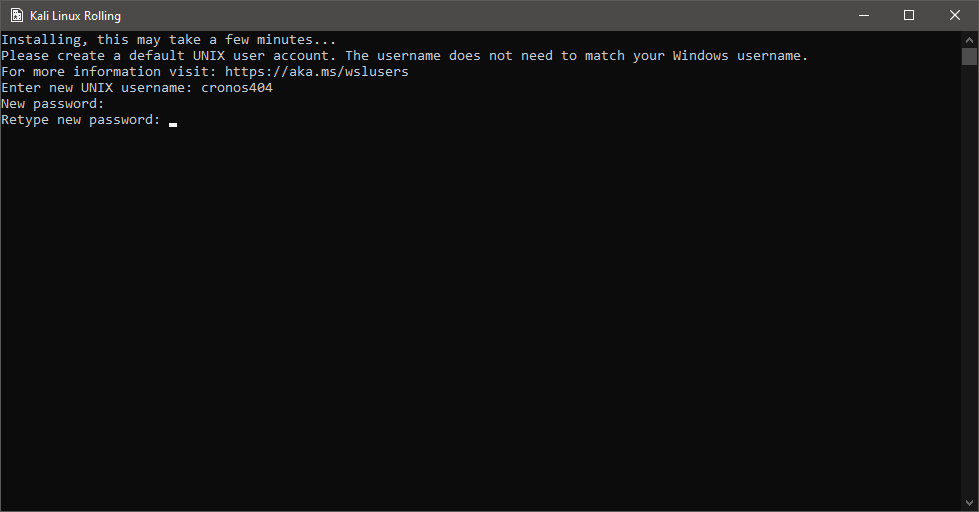

Y listo, ya tendríamos instalada la distribución de Kali Linux en nuestro ordenador.


Ahora, lo siguiente que haremos será ejecutar el Windows Terminal como administrador

Y esto lo haremos escribiendo **Terminal** en la barra de búsqueda.


Luego procederemos a darle un clic derecho a la que dice **Terminal Aplicación**, para acto seguido darle un clic izquierdo a la opción que dice **Ejecutar como administrador**.

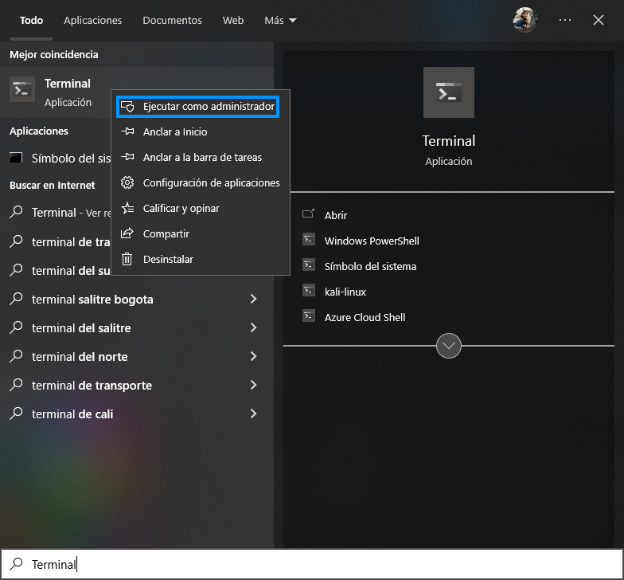

Una vez que hemos ejecutado el programa, le daremos un clic izquierdo a la flecha que está a la derecha del botón de nueva pestaña, tal y como se indica en las siguientes imagenes.


Luego haberle dado clic, se nos desplegaran unas opciones en las que podremos seleccionar **Kali Linux** para así dar un clic izquierdo sobre esta.

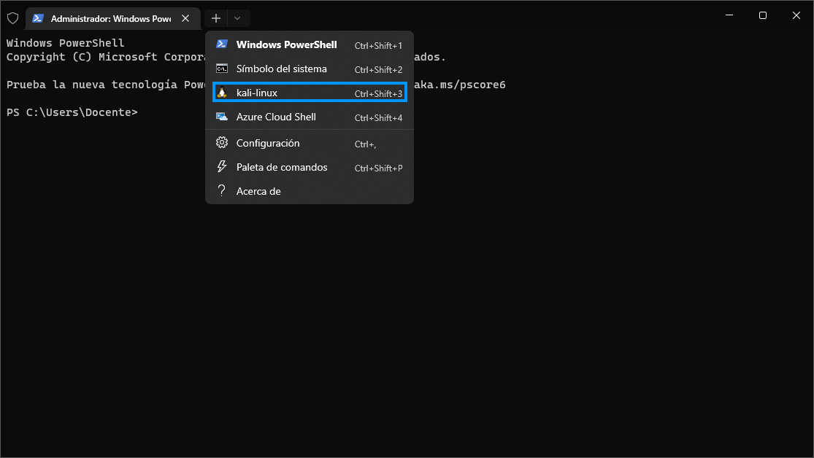

Una vez que le hemos dado clic, se nos abrirá una nueva pestaña en la que podremos observar la terminal de Kali Linux.


Y acto seguido procederemos a escribir el siguiente comando y presionaremos la tecla **Enter** para continuar.

```
sudo apt update && sudo apt upgrade -y
```

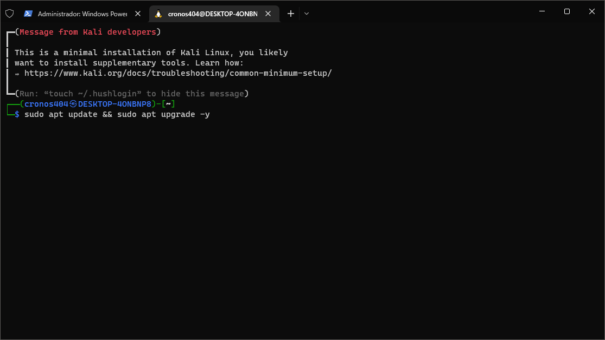

Una vez que presionamos la tecla enter, nos pedirá ingresar nuestra contraseña, y luego de ingresarla, procederemos a presionar la tecla **Enter**, para así dar inicio al proceso de actualización y la mejora.

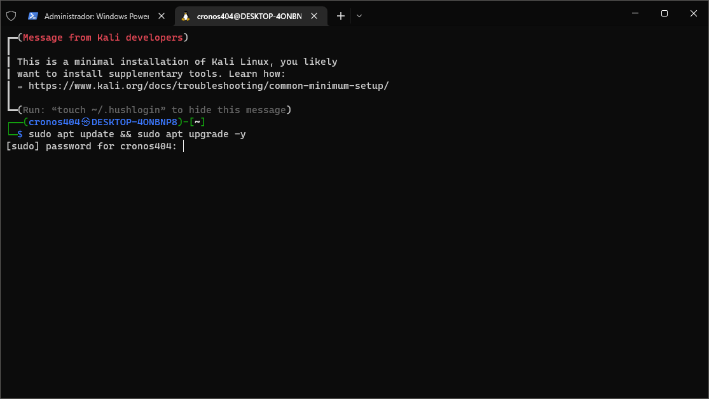


---
Una vez que ha terminado de actualizar y mejorar, escribiremos el siguiente comando, que sirve para limpiar la pantalla de la consola y acto seguido presionaremos  la tecla **Enter** para limpiar.

```
clear
```


Ahora, lo siguiente que haremos será usar el siguiente comando y le daremos un **Enter** para entrar en la carpeta **Root**.


```
cd /
```

> **NOTA:** Los siguientes comandos solo serán para hacer unas pequeñas pruebas para ver si las carpetas se instalaron bien en el Kali Linux. No es necesario que los escriban si no quieren.


Una vez que estemos en la carpeta root, procederemos a usar el siguiente comando y le daremos un **Enter** para listar el contenido de esta carpeta.

```
ls
```

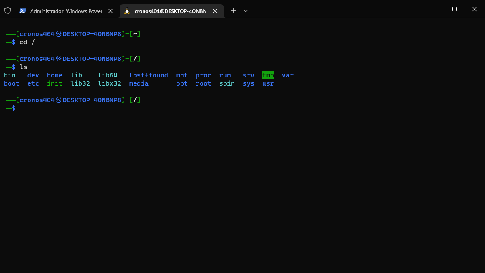

Una vez aquí, lo siguiente que haremos será darle un clic izquierdo a la pestaña de **Administrador: Windows PowerShell** para seleccionarla y ubicarnos en esta.

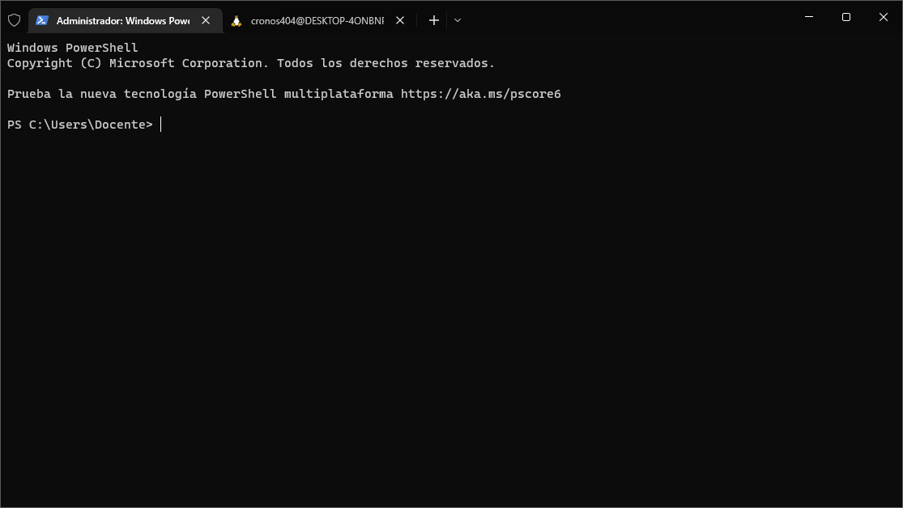

Y aquí, escribiremos el siguiente comando y le daremos un **Enter** para hacer una consulta de lista de las distribuciones instaladas de Linux, incluyendo su estado de ejecución (si se está ejecutando o si está detenida) y la **versión de WSL** que está ejecutando distribución en ese momento.

```
wsl -l -v
```

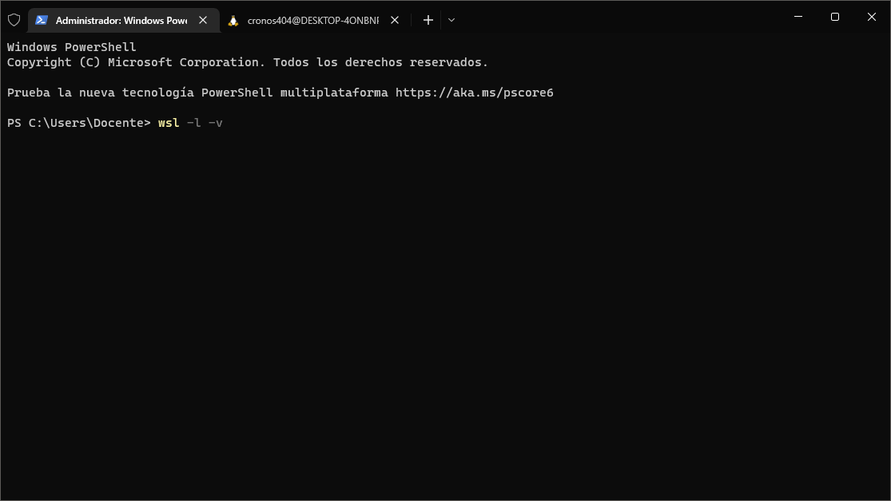

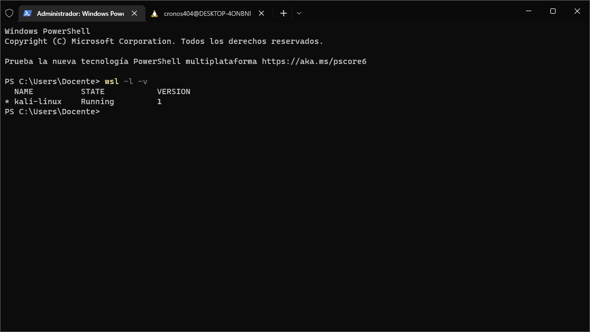

Aquí como podrán observar, nosotros tenemos la distribución de kali linux que está corriendo en la versión de **WSL 1** y como nosotros queremos que este en la versión de **WSL 2**, así que, para hacer el cambio, tendremos que hacer lo siguiente.

Vamos a escribir el siguiente comando y le daremos **Enter** para así establecer una versión predeterminada de WSL 2.

```
wsl --set-default-version 2
```

Luego de esto, esperaremos unos cuantos minutos a que salga un mensaje que dice **La operación se completó correctamente**.

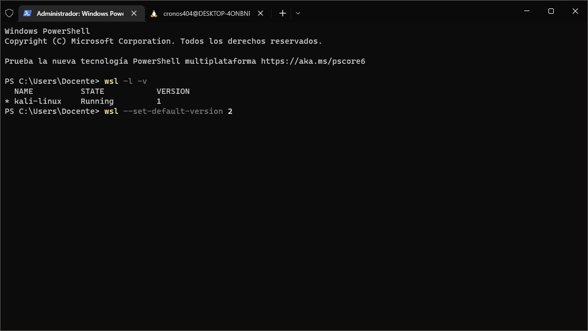

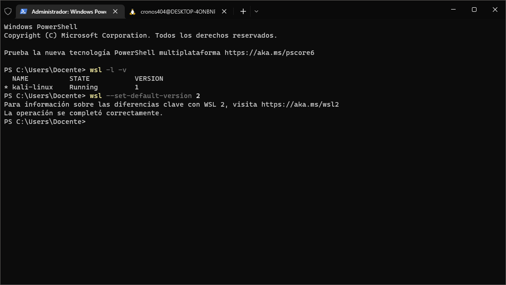

Una vez que hemos establecido una versión predeterminada en WSL 2, escribiremos el siguiente comando y le daremos **Enter** para establecer la versión de **WSL** de la distribución en 2.

```
wsl --set-version kali-linux 2
```

Luego de esto, esperaremos unos cuantos minutos a que nos salga un mensaje que dice **Conversión completada**.

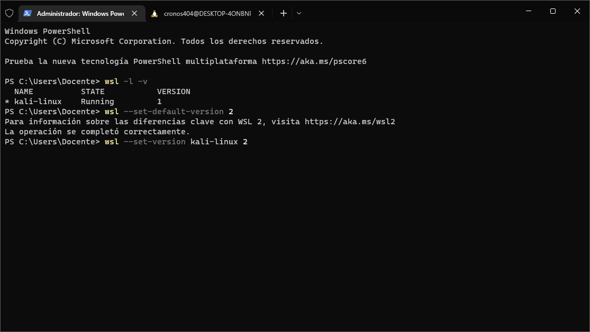


Luego de esto procederemos a escribir otra vez el comando `wsl -l -v` y le daremos un **Enter** para verificar nuevamente el estado y la versión de nuestra la distribución.


Aquí, como se puede ver en la imagen anterior, tanto la versión como el estado de ejecución han cambiado y ahora nos sale que la distribución de kali linux se está ejecutando está en la versión 2 y también podemos ver que el estado de ejecución sale como detenido.

Esto lo podremos comprobar dando un clic izquierdo en la pestaña del kali linux para ubicarnos en esta y aquí veremos que en nuestro caso nos sale un mensaje que dice **[proceso terminado con el código 4294967295 (0xffffffff)]**


Luego que hemos verificado lo anterior, regresaremos a la pestaña de Administrador: Windows PowerShell y procedemos a escribir el siguiente comando y presionaremos la tecla **Enter** para salir.

luego de esto, lo siguiente que haremos será cerrar las pestañas de Administrador: Windows PowerShell y la de kali Linux y esto lo haremos escribiendo el siguiente comando para acto seguido presionar la tecla **Enter** para salir de la pestaña.

```
exit
```

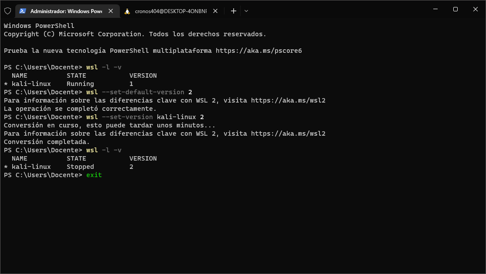

Una vez hecho lo anterior, procederemos a abrir nuevamente el terminal como administrador y procederemos a abrir una pestaña de kali Linux tal y como hicimos anteriormente, para acto seguido escribir el comando `wsl -l -v` por una última vez para verificar se ha efectuado el cambio y para verificar que definitivamente la distribución está corriendo el en la versión 2.


Y listo, una vez que hemos verificado este cambio, ya podríamos decir que hemos tenemos instalado el wsl 2 y ya podríamos dar por finalizado este tutorial.

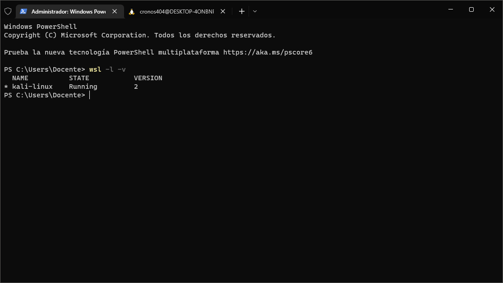